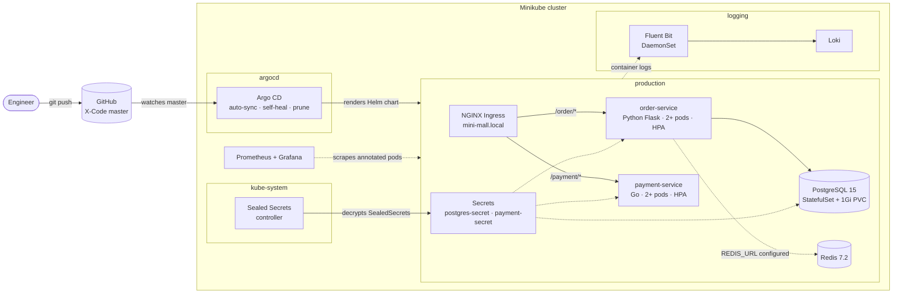

# Mini Production Platform: Payment System on Kubernetes

A small payment system run the way a production platform would be: two microservices, a database and a cache, packaged as one Helm chart, delivered by Argo CD from Git, with encrypted secrets, autoscaling, logging and metrics. It runs on a single Minikube node, and it comes with a set of failure drills that reproduce common Kubernetes incidents.

## Architecture



| Component | What it is | Where it's defined |
| --- | --- | --- |
| order-service | Python Flask API on port 5000. `GET /health` checks DB connectivity, `POST /` writes an order to Postgres | `online-payment/order-service/`, `templates/order-backend-*.yaml` |
| payment-service | Go HTTP service on port 8080. `GET /health`, `/pay` | `online-payment/payment-service/`, `templates/payment-backend-*.yaml` |
| PostgreSQL | StatefulSet with a 1Gi PVC behind a headless Service (`postgres-service`) | `templates/postgres.yaml` |
| Redis | Single-replica cache, wired into order-service via `REDIS_HOST` / `REDIS_URL` | `templates/redis.yaml` |
| Ingress | NGINX, host `mini-mall.local`, rewrites `/order/*` and `/payment/*` to each service | `values.yaml` → `ingress` |
| HPA | One per service, 2–100 replicas at 80% CPU | `templates/hpa.yaml` |
| Secrets | SealedSecrets committed to Git (GitOps path) or plain Secrets for local runs | `templates/sealed-secrets.yaml`, `templates/secrets.yaml` |
| GitOps | Argo CD Applications for the app chart and the Sealed Secrets controller | `argocd/` |
| Logging | Fluent Bit DaemonSet ships container logs, with Kubernetes metadata, to Loki | `logging/` |
| Metrics | Prometheus pod scrape config, recommended Grafana dashboards (IDs 3119, 15757) | `deploy/apps/mini-app/monitoring/` |

Chart path: `deploy/apps/mini-app/charts/backend/`.

## One-command deploy (local)

Prerequisites: [Minikube](https://minikube.sigs.k8s.io/docs/start/), kubectl, [Helm 3](https://helm.sh/docs/intro/install/), Docker.

```bash
git clone https://github.com/katentake/X-Code.git && cd X-Code
./mini-k8s-platform/scripts/deploy-local.sh
```

The script:

1. Starts Minikube and enables the `ingress` and `metrics-server` addons.
2. Builds `mini-order:v1.0.4` and `mini-payment:v1.0.0` inside Minikube's Docker daemon (the chart uses `imagePullPolicy: Never`).
3. Installs the chart as release `mini-production-platform` in namespace `production`, using plain Secrets with a generated Postgres password (reused on re-runs).
4. Waits for Postgres, payment-service and order-service to roll out.

Smoke test:

```bash
kubectl -n production port-forward svc/order-service 8081:80 &
kubectl -n production port-forward svc/payment-service 8082:80 &
curl localhost:8081/health        # {"status":"healthy","database":"connected"}
curl -X POST localhost:8081/      # {"status":"order_created","order_id":1}
curl localhost:8082/pay           # {"status":"paid",...}
```

Through the ingress instead (on macOS, keep `minikube tunnel` running in another terminal):

```bash
curl -H 'Host: mini-mall.local' http://127.0.0.1/order/health
curl -H 'Host: mini-mall.local' http://127.0.0.1/payment/pay
```

## GitOps deploy (Argo CD + Sealed Secrets)

This is how the platform runs as "production": Git is the source of truth and nothing is applied by hand.

```bash
# 1. Install Argo CD
kubectl create namespace argocd
kubectl apply -n argocd -f https://raw.githubusercontent.com/argoproj/argo-cd/stable/manifests/install.yaml

# 2. Install the Sealed Secrets controller through Argo CD, then back up its private key
kubectl apply -f mini-k8s-platform/argocd/sealed-secrets-app.yaml
mini-k8s-platform/scripts/backup-sealed-secrets-key.sh

# 3. Re-seal the secrets for this cluster (the committed ciphertext only decrypts with the original key)
mini-k8s-platform/scripts/seal-secrets.sh production
#    paste the output into templates/sealed-secrets.yaml, commit and push

# 4. Build the images inside Minikube (step 2 of the local script), then hand the app to Argo CD
kubectl apply -f mini-k8s-platform/argocd/argo-app.yaml
```

From then on every push to `master` is synced automatically. `selfHeal` reverts manual `kubectl` changes and `prune` removes resources deleted from Git. Key backup and recovery are covered in [docs/sealed-secrets-key-management.md](docs/sealed-secrets-key-management.md).

## Failure drills

Each manifest in `deploy/apps/mini-app/` breaks one thing on purpose. Apply it, diagnose it with the commands shown, then fix it.

| Drill | Apply | What you see | What it teaches | Fix |
| --- | --- | --- | --- | --- |
| Bad readiness probe | `bad-readiness-demo.yaml` | Pod `Running` but `0/1 READY`; events show `Readiness probe failed: 404`; the Service has no endpoints | Readiness controls traffic, not restarts. A failing readiness probe silently takes a pod out of load balancing, which shows up as 502/503 at the edge while every pod looks "up" | Point the probe at a real health path |
| Wrong liveness port | `wrong-health-check.yaml` | Restart count keeps climbing, then `CrashLoopBackOff`; events show `connection refused` on port 8080 | A healthy app can be killed by a wrong liveness probe. Always check probe config before blaming the code | Probe the port the app actually listens on (80) |
| OOM kill | `oom-bomb.yaml` | Pod status `OOMKilled`, exit code 137 in `kubectl describe pod` | Memory limits are enforced by the kernel, not Kubernetes. A container over its limit is killed immediately, with no graceful shutdown | Raise the limit or fix the memory use; size limits from real usage |
| Unsatisfiable nodeSelector | `ssd-pod-deployment.yaml` | Pod stuck `Pending`; `FailedScheduling: node(s) didn't match Pod's node affinity/selector` | Scheduling constraints fail closed. The pod waits forever instead of running somewhere wrong | `kubectl label node minikube disk=ssd`, or remove the selector |
| Hard vs soft node affinity | `node-affinity-deployment.yaml` | Pod `Pending`: the required zone (`us-west-2a/b`) doesn't exist on Minikube, while the preferred `hardware-type=gpu` rule alone would not block it | `required…` rules block scheduling; `preferred…` rules only influence it | Label the node with a matching zone, or move the rule to `preferred` |
| Least-privilege RBAC | `test-role.yaml`, `test-binding.yaml` | `kubectl auth can-i list pods --as=system:serviceaccount:default:test-user` → yes; `delete pods` → no | Scoping a ServiceAccount to read-only access on pods and their logs | First run `kubectl create serviceaccount test-user` |

Useful commands for every drill: `kubectl get pods -w`, `kubectl describe pod <name>`, `kubectl get events --sort-by=.lastTimestamp`, `kubectl get endpoints`, `kubectl logs <pod> --previous`.

## Real issues hit while building this

These came up during development and are fixed in the Git history; they are the most useful part of the project.

| Issue | Root cause | Fix |
| --- | --- | --- |
| Argo CD stuck `OutOfSync` on `postgres-service` | Switching the Service to headless (`clusterIP: None`) changes an immutable field; `Replace=true` alone still sends a PUT that is rejected | `argocd.argoproj.io/sync-options: Force=true,Replace=true`, so Argo CD deletes and recreates the Service |
| Sealed Secrets controller failed to install | The Helm repo moved from `bitnami-labs` to `bitnami`; the old URL returns 404 | Point the Application at `https://bitnami.github.io/sealed-secrets` and pin the chart version |
| Replica count flapping | HPA `minReplicas` below the chart's `replicaCount`, so HPA scaled down and Argo CD self-heal scaled back up | Keep `minReplicas` equal to the declared `replicaCount` (2) |
| order-service false restarts | Default 1s liveness timeout was shorter than slow `/health` DB checks | Liveness `timeoutSeconds: 5`, readiness `3` |
| order-service could not reach Redis | `REDIS_HOST` used the wrong Service name | Use the release-scoped name `mini-production-platform-redis-svc` |
| Secrets in Git | Plaintext credentials can't be committed in a GitOps repo | SealedSecrets in Git, plaintext sources git-ignored, controller key backed up offline |

## Repository layout

```
mini-k8s-platform/
├── argocd/                     Argo CD Applications (app chart, Sealed Secrets controller)
├── deploy/apps/mini-app/
│   ├── charts/backend/         Helm chart: services, Postgres, Redis, ingress, HPA, secrets
│   ├── monitoring/             Prometheus scrape config, Grafana dashboard IDs
│   └── *.yaml                  failure drills
├── docs/                       Sealed Secrets key management
├── logging/                    Fluent Bit values, Loki
└── scripts/                    deploy-local.sh, seal-secrets.sh, backup-sealed-secrets-key.sh
online-payment/                 service source code and Dockerfiles
```
